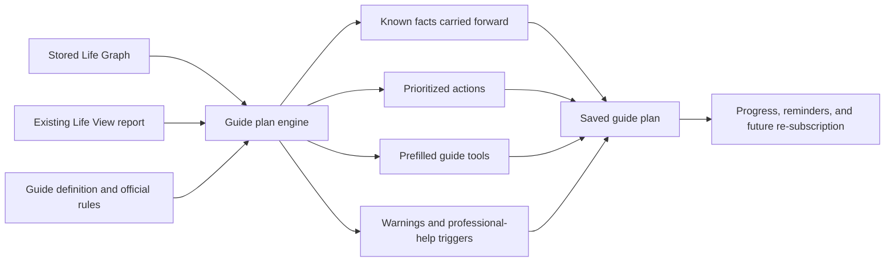

# Guide Personalization Without Additional API Usage

**Decision date:** July 20, 2026  
**Owner:** Christine Smith  
**Status:** Approved product direction; shared implementation foundation built and production build verified; database migration and live QA pending

## Product Decision

Paid guides are enhancements to an active Krovos subscription. By the time a user can purchase a guide, Krovos has already generated the user's Life View and stores the user's Life Graph. Guide personalization must therefore reuse that existing information and should not make another model call merely to restate, reorganize, or operationalize facts Krovos already knows.

The guide promise is:

> Krovos already understands your life. A guide turns that understanding into a focused, saved plan for the life event in front of you.

This supports the Krovos model:

- **White-glove service:** Krovos carries known facts forward and prepares the plan before asking the user for anything else.
- **Burden relief:** the user receives a prioritized sequence, not another research assignment.
- **Customized guidance:** actions, warnings, dates, and tool defaults respond to the user's household data.
- **Continuity:** the plan is saved to the Krovos account and can be resumed after a future re-subscription.
- **Cost control:** deterministic application logic handles repeatable work without consuming additional AI credits.

## Access and Ownership Policy

- A guide is a one-time enhancement purchase attached to the user's Krovos account.
- An active Krovos subscription is required to access the account, guide, personalized plan, and guide tools.
- When subscription access ends, guide access ends with the account-access deadline.
- The purchase record and saved guide plan remain associated with the account.
- If the user re-subscribes, the guide and saved plan become available again without another guide purchase.
- Retirement is part of the Core Retirement Hub and is not a separate paid guide.

## Existing Data That Can Be Reused

### Life Graph

The current `life_graph` record already stores enough structured information to personalize most guide decisions:

- identity, age, state, city, relationship and household structure;
- partner information, children, pregnancy/expecting status, and aging-parent context;
- income types, take-home pay, side-hustle and self-employment income;
- spending, debts, housing, cash, investments, retirement goals, pensions, and insurance;
- employer benefits, HSA/FSA, equity, disability coverage, and life insurance;
- visa, work-authorization, immigration-cost, and remittance context;
- wedding, college, business, caregiving, fresh-start, survivor, and upcoming-event context;
- user-stated non-negotiables and financial concerns.

### Existing Life View report

The latest `reports` row with `report_type = life_understanding` stores the already-paid-for personalized narrative:

- household snapshot;
- burden inventory;
- priority guidance;
- opportunities;
- first step and path forward.

Guides may reuse relevant report items verbatim as previously generated guidance, provided they are visibly identified as coming from the user's existing Life View and are not treated as a substitute for current structured facts.

### Existing deterministic calculations

Krovos already has reusable calculation logic for net worth, retirement bridges, taxes, rent-versus-buy, emergency funds, debt, and many guide-specific comparisons. Guide plans should link to and prefill those tools rather than reproduce financial formulas in prose.

## Deterministic Personalization Flow

No model call is required for this flow.

## Shared Personalized Guide Experience

Every paid guide must contain the following shared layer before its editorial content:

### 1. What Krovos already knows

Show only facts relevant to the guide. Examples include state, household structure, expected child, current housing, emergency-fund months, identified disability coverage, business stage, or work-authorization status.

Rules:

- Never ask for a known fact again.
- Never display seeded or unconfirmed data as user-provided truth.
- Show “Not yet captured” rather than assuming zero.
- Provide a direct update path when a missing fact materially affects the plan.

### 2. Your Krovos plan

Create three to seven sequenced actions with:

- priority and timing;
- why it matters for this specific household;
- the Krovos tool or account area that completes it;
- a clear completion condition;
- progress saved to the account.

The language should describe what Krovos has prepared and what the user needs to decide, upload, confirm, or authorize. It should not turn Krovos into a homework generator.

### 3. Already identified in your Life View

Reuse relevant burden, priority, and opportunity items from the existing report. Do not make another API call. Structured Life Graph data controls calculations and current facts if the report and Life Graph conflict.

### 4. Saved decisions and scenarios

Guide-specific tools should persist meaningful results to the guide plan. At minimum, save:

- tool route and version;
- scenario name;
- important inputs copied from the Life Graph;
- user-supplied inputs;
- output summary;
- decision or selected scenario;
- completion date.

Local-browser storage alone does not meet the premium continuity standard.

### 5. Professional-help triggers

Legal, tax, immigration, benefits, healthcare, and estate topics require deterministic routing rules. Krovos should prepare the facts and handoff packet, then identify when a qualified professional or government agency is needed. Krovos must not imply that generic app output replaces licensed advice.

## Data Precedence

When sources differ, use this order:

1. Current structured Life Graph data entered or confirmed by the user.
2. Current saved result from a deterministic Krovos tool.
3. Existing Life View report narrative.
4. Guide defaults and general educational content.

The guide engine must not copy a numerical recommendation out of the Life View if the underlying Life Graph has since changed.

## Saved Plan Model

Create a `guide_plans` record for each user and purchased guide:

- `user_id`
- `guide_id`
- `guide_slug`
- `plan_version`
- source Life Graph and report timestamps
- deterministic plan JSON
- action statuses
- saved tool results and decisions
- created, updated, and completed timestamps

The plan is user-restricted by row-level security. Household members with inherited guide purchase access receive their own personalized plan based on their own permitted Life Graph data; they do not silently share a single private plan.

## Portfolio Personalization Matrix

| Guide | Existing data to carry forward | Deterministic personalized outcome |
|---|---|---|
| Early Career | income, employer benefits, debts, cash, housing intent | first-90-days plan, match capture, debt order, apartment-readiness sequence |
| Newlywed | partner, finance style, wedding event/budget, debts, beneficiaries/insurance gaps | account-model decision, wedding funding path, post-marriage administration plan |
| Immigration | visa/status, work authorization, state, costs, remittance, household income | authorization-gap runway, cost timeline, portable-account and professional-routing plan |
| Home Buying | housing type, income, spending, cash, debts, goals, location | maximum household payment, cash-to-close/reserve guardrails, property comparison sequence |
| New Parent | expecting/children, state, benefits, income, childcare context, insurance | birth-year cash calendar, leave gap, coverage path, childcare and protection sequence |
| College Planning | children and ages, 529, income, household/stepparent context | four-year funding plan, aid contributor path, parent/student borrowing guardrails |
| Career Transition | leaving-job timeline, income, cash, benefits, equity, debts | before-notice timeline, runway, coverage bridge, saved offer decision memo |
| Starting a Business | business stage, revenue, expenses, benefits, household floor | Revenue Target, benefits-replacement plan, entity/tax/retirement sequence, launch scorecard |
| Gig Work | self-employment income, spending, cash, benefits, platforms where supplied | baseline/ceiling/floor plan, tax reserve, runway, recurring monthly/quarterly operating rhythm |
| Divorce | household structure, debts, property, support obligations, fresh-start context | safety-aware inventory, temporary-plan flags, settlement scenarios, single-income rebuild |
| Caregiving | aging parent, care costs, work impact, siblings/household where supplied | care-cost path, caregiver exposure, benefits routes, family contribution plan |
| Disability | benefits and policy context, income, spending, cash, medical costs | month-by-month income/coverage plan, claim documentation, benefit offsets, return-to-work path |
| Widowhood | survivor context, accounts, income, children, property, benefits | date-aware first-year plan, urgent-versus-wait sequence, survivor and professional handoffs |
| Blended Family | partner, children, prior obligations, college and estate context | household obligations agreement, inheritance conflict flags, FAFSA and estate decisions |
| Estate Planning | household, dependents, property, beneficiaries, insurance, state | readiness inventory, discrepancy report, decision-maker record, attorney handoff packet |
| Inheritance | role, asset types, dates, existing goals and debts | deadline calendar, basis/document record, irreversible-decision warnings, integration plan |

Retirement uses the same principles inside the Core Retirement Hub rather than the paid-guide system.

## A-Level Release Standard

A guide is not available for sale until it scores at least 90/100 and passes every hard gate below.

### Hard gates

1. Factual and safety review is complete with current official sources.
2. Guide-specific tools are purchase-gated and active-subscription-gated without fail-open access.
3. Relevant Life Graph inputs prefill correctly.
4. The personalized plan renders without a model call.
5. Actions and important tool results persist to the account.
6. Missing data is handled explicitly and never treated as zero.
7. Professional-help triggers and handoff language are present where required.
8. Cancellation and re-subscription behavior is verified.
9. Mobile, accessibility, empty-state, and household-access QA pass.
10. A beta user completes the guide and confirms that it reduced work, confusion, or decision burden.

### Value requirements

The guide must:

- produce a decision, plan, timeline, or handoff artifact;
- make visible use of the user's existing Krovos context;
- avoid re-asking questions Krovos already answered;
- save meaningful progress;
- explain what changed or became easier because the user purchased it;
- leave the user's Core Life Graph or ongoing plan more useful than before.

## API Usage Boundary

No additional API call is needed for:

- selecting relevant Life Graph facts;
- calculating thresholds and scenarios with existing engines;
- sorting actions by deterministic urgency;
- prefilling tools;
- rendering checklists and timelines;
- saving progress and decisions;
- reusing already-generated Life View priorities;
- scheduling rule-based reminders.

An optional future model call may be appropriate only when the user explicitly requests a newly written explanation or Krovos Guide conversation. It must not be required to unlock the purchased guide's promised value.

## Implementation Sequence

1. **Built:** shared deterministic plan engine and versioned `guide_plans` migration.
2. **Built:** shared personalized-plan UI on the purchased-guide page.
3. **Built:** initial definitions for all 16 paid guides using relevant Life Graph fields and existing Life View items.
4. **Partially built:** action progress persists to `guide_plans`; meaningful outputs from each guide tool still need account persistence.
5. Upgrade each guide's content, sources, routing rules, and tools in the release order maintained in the guide value audit.
6. Run beta completion tests and re-score each guide.
7. Publish no paid guide until every guide reaches A or above, per founder decision.

## Implementation Record — July 20, 2026

The Krovos app now contains:

- `lib/guide-personalization.ts`: a deterministic plan definition for every paid guide;
- `app/components/PersonalizedGuidePlan.tsx`: relevant known facts, existing Life View connections, prioritized next steps, completion criteria, missing-data routing, and persisted completion state;
- `supabase/migrations/20260720_guide_plans.sql`: saved plans, action statuses, tool-result storage, timestamps, indexes, and user-owned row-level security;
- fail-closed guide-tool access when a configured guide slug cannot be resolved;
- shared copy explaining that the plan reuses saved Krovos information and does not generate another AI report.

The production build passes with all 145 application routes. This foundation does **not** by itself make every guide A-level. Before release, the migration must be applied, each guide tool must save its meaningful result, current official sources and professional-routing rules must be completed, and beta/live QA must pass.
