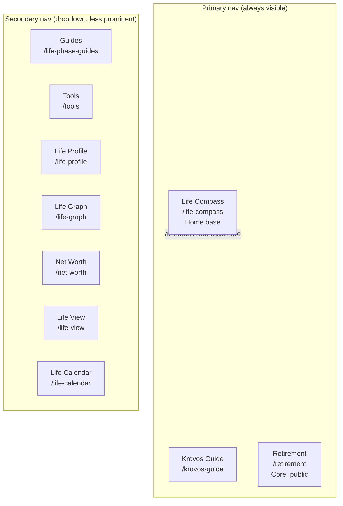
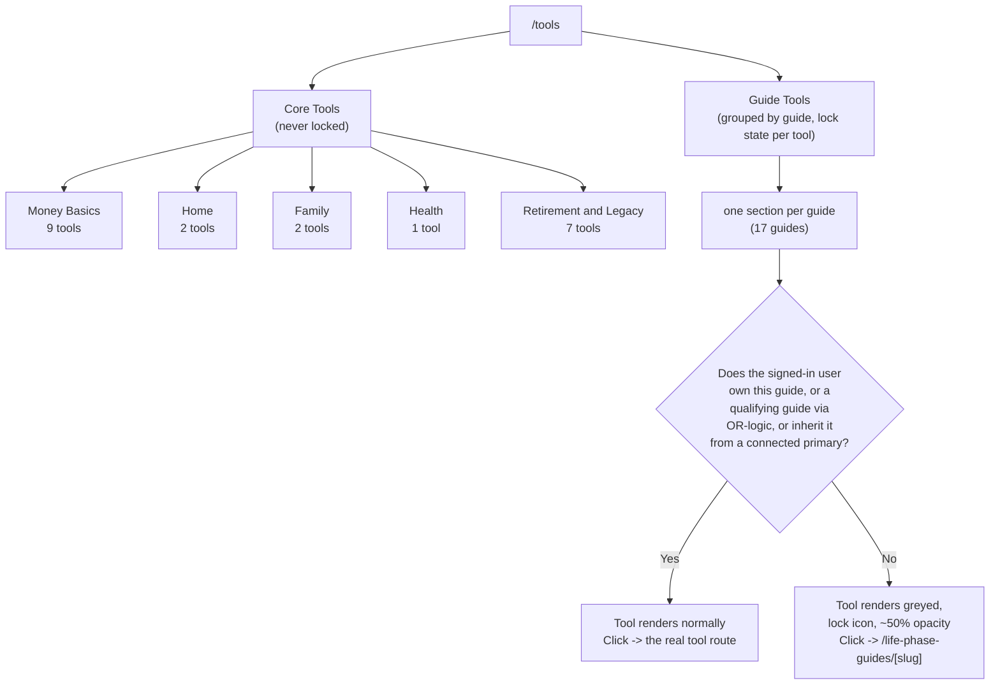
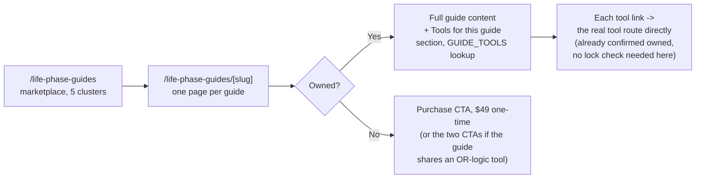

# Navigation and Access Structure

**Established:** July 17, 2026
**Source:** `app/components/GlobalNav.tsx`, `proxy.ts`, `app/tools/page.tsx`, `app/life-phase-guides/[slug]/page.tsx`, as they exist post the July 17, 2026 tool renaming pass and `/tools` locked-tool rebuild. Re-verify against these files directly before trusting this diagram in a future session -- nav structure and tool routes are the parts of this codebase most likely to drift.

This replaces the long-standing backlog item asking for a visual (not text-only) map of how a user reaches each guide and tool.

---

## Top-level navigation (every page, via GlobalNav)



---

## `/tools` structure (post July 17, 2026 rebuild)

`/tools` is one page in two sections. Section 1 (Core Tools) is never gated. Section 2 (Guide Tools) shows every tool but locks the ones tied to a guide the signed-in user does not own.



Ownership check (client-side, on `/tools` mount): query `life_phase_guides` for id+slug, query `user_guide_purchases` for the signed-in user's owned guide ids, and for any guide not directly owned, check `/api/household/guide-access` (connected-subscriber inheritance from a primary subscriber). Six tools carry more than one qualifying guide slug (OR-logic) and unlock if the user owns *any* of them: Life Insurance Calculator (New Parent or Estate Planning), FAFSA Remarriage Planner (College Planning or Blended Family), QTIP vs. Bypass Comparison (Blended Family or Estate Planning), and the Divorce/Widowhood trio -- Emergency Fund Rebuilder, Single Income Planner, Credit Rebuilding Planner.

---

## Guide page structure



The client-side check on the guide page itself (`GuideGate`, wrapping every guide-exclusive tool route directly) is a second, independent gate below the `/tools` lock treatment above -- a user who bypasses `/tools` entirely and pastes a tool URL directly still hits `GuideGate`, which redirects unauthenticated visitors to sign-in and shows the same purchase CTA to signed-in non-owners. `/tools`'s lock treatment is a discoverability/UX layer; `GuideGate` is the actual enforcement layer, per the July 15, 2026 "Guide-Exclusive Tool Enforcement" decision in CLAUDE.md.

---

## Where a locked tool click actually goes

```mermaid
flowchart LR
    CLICK["User clicks a locked tool\non /tools"] --> GUIDEPAGE["/life-phase-guides/[slug]"]
    GUIDEPAGE --> CHECK{"Owned?"}
    CHECK -->|No| CTA2["Purchase CTA shown"]
    CHECK -->|"Yes (edge case: ownership\nchanged between page load\nand click)"| REAL["Full guide content,\nreal tool link available"]
